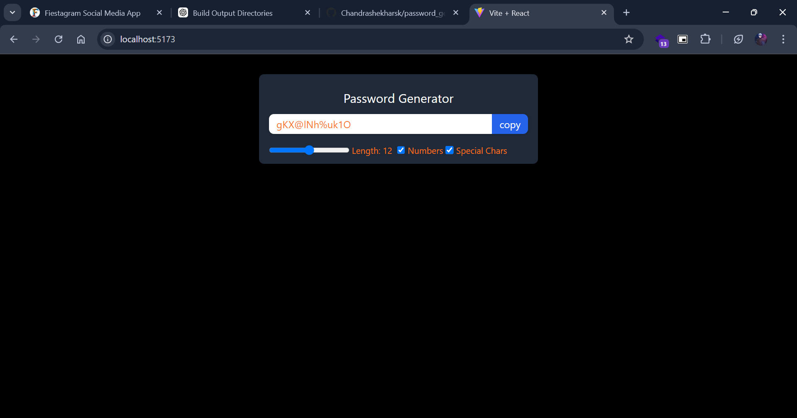

# Password Generator

A simple React application that allows users to generate secure passwords by selecting the desired length, and including numbers and special characters.

## Features

- **Customizable Length:** Choose the length of the password (e.g., 8 to 128 characters).
- **Include Numbers:** Option to include or exclude numbers in the password.
- **Include Special Characters:** Option to include or exclude special characters (e.g., `!@#$%^&*`).
- **User-Friendly Interface:** Simple and intuitive UI to generate and copy passwords.

## Screenshots



## Getting Started

Follow these instructions to get a copy of the project up and running on your local machine.

### Prerequisites

Make sure you have the following installed:

- **Node.js** (v14 or later)
- **npm** (v6 or later) or **Yarn**

### Installation

1. **Clone the repository:**

   ```bash
   git clone https://github.com/yourusername/password-generator.git
   cd password-generator
